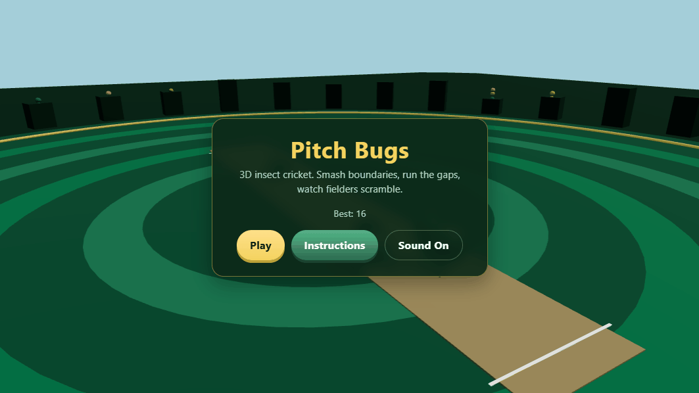

<div align="center">

# Pitch Bugs

[](https://grok.x.ai/)
[](#)
[](https://threejs.org/)
[](#)
[](https://www.typescriptlang.org/)
[](https://vitejs.dev/)

**3D insect cricket for the browser** — time your swing, run the gaps, and chase a high score before the fielding beetles take your wicket.



[Play on GitHub Pages](https://siddqamar.github.io/cricket-doodle-inspired/)

</div>

---

## What’s the game?

You’re a little bug with a bat. One button. Big vibes.

- **Time the bounce** — click, tap, or hit Space / Enter to swing  
- **Smash boundaries** — six on the full, four after the bounce  
- **Run the gaps** — soft shots turn into 1s and 2s (a rare 3 if the fielders nap)  
- **Watch the scramble** — fielders chase, cut off runs, and only catch on the full  
- **Survive the innings** — early overs are friendlier; pace and fielding heat up later  

Two batting bugs at the creases, a whole stadium of insects, and a camera that leans into the big moments. No accounts, no backend — just you vs the beetles.

Built as a **vibe-coded** project with [Grok Build](https://grok.x.ai/) — original art, procedural audio, and a tiny static site you can host anywhere.

## Controls

| Action | Input |
|--------|--------|
| Swing | Click, tap, Space, or Enter |
| Pause | P or Esc |
| Mute | M |

## Play locally

```bash
npm install
npm run dev
```

Open the URL Vite prints (usually `http://localhost:5173`).

## Build

```bash
npm run build
```

Output lands in `dist/`. Ready for GitHub Pages (this repo deploys on every push to `main` via Actions).

## License

See [LICENSE](./LICENSE).
